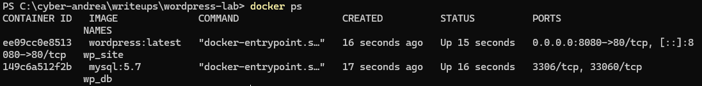
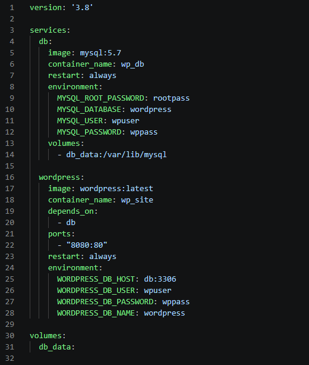
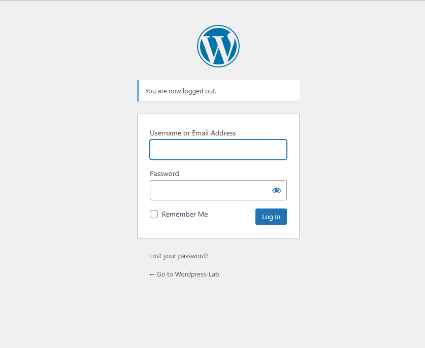
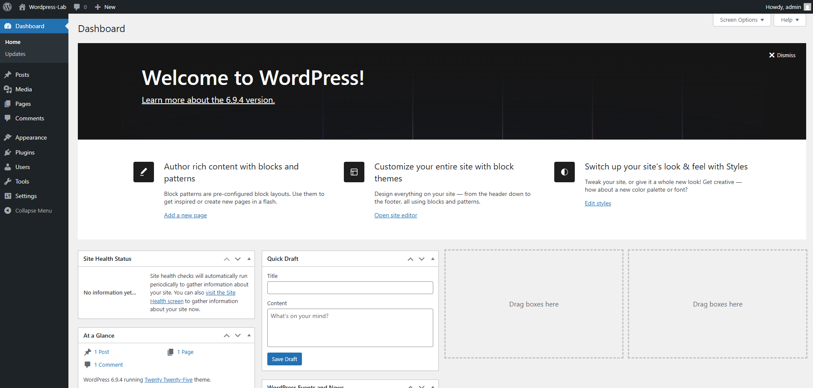

#  WordPress Cybersecurity Lab
---
###  1. Environment Deployment with Docker

This lab was built using Docker to create an isolated and reproducible environment for cybersecurity practice.

The environment includes:

- WordPress (CMS)
- MySQL database

All services are deployed using Docker Compose.

## 2. Docker running:



---

###  3. Configuration

The environment is defined using a docker-compose.yml file, which automates service creation and internal networking.



---

###  4. Running the environment

To start the lab environment, Docker Compose is used to automatically deploy and configure all required services. Once the containers are running, the WordPress service becomes available locally through the configured port.

http://localhost:8080




## 5. WordPress dashboard

WordPress admin panel confirming the environment is fully operational.




To start the lab:

```bash
docker compose up -d
```

## 6. Attack phase

   - XML-RPC endpoint was tested for brute force abuse
   - Authentication mechanism was evaluated under weak credentials
   - Access control limitations were analyzed